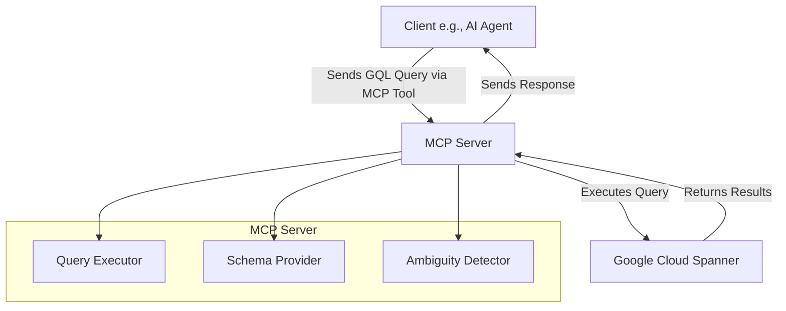
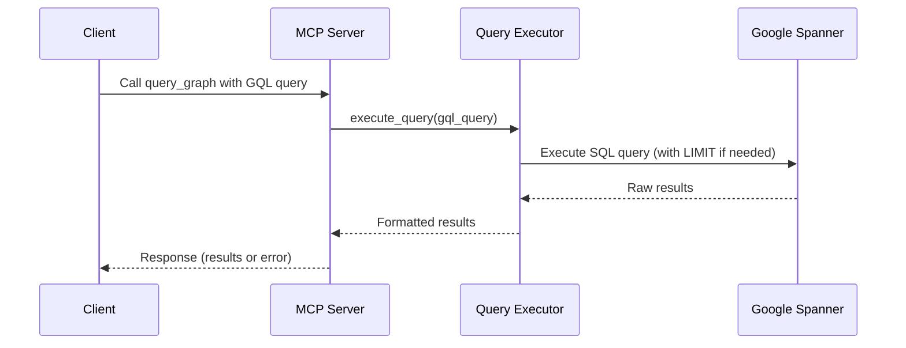

# Architecture Overview: TextQL MCP Server

## Introduction

The TextQL MCP (Model Context Protocol) server is a backend service designed to facilitate natural language to SQL/GraphQL query translation, with a focus on integrating with Google Cloud Spanner for querying a Wikidata-derived graph database. The project adheres to MCP principles, where the server provides tools and resources for query execution and schema provision, while complex logic like natural language processing is handled client-side (e.g., by AI agents).

Key goals:
- Enable efficient querying of graph data stored in Spanner.
- Support client-driven GraphQL (GQL) queries.
- Maintain modularity for easy extension and maintenance.
- Deprecate server-side NL processing in favor of client orchestration.

The architecture emphasizes separation of concerns, using protocols for interfaces and factory functions for instantiation. It currently uses standard SQL queries on vertex/edge tables in Spanner, without leveraging native Spanner Graph features (e.g., GRAPH clause), treating the data as relational tables.

## High-Level Architecture

The system follows the MCP client-server model:

### Component Diagram



- **Clients** (e.g., AI agents): Generate GQL queries, handle ambiguity, and refine based on server feedback.
- **Server**: Executes provided GQL queries against Spanner, provides schema information, and returns results or errors.

Core components:
- **Entry Points**: Scripts like `spanner_wikidata_server.py` and `run_mcp_server.sh` for launching the server.
- **Factory and Core Logic**: `main_spanner.py` and `core/server.py` for creating and running the MCP server with Spanner-specific implementations.
- **Utilities**: Modular classes in `utils/` for query execution, schema provision, and ambiguity detection.
- **Configuration**: YAML files (e.g., `config/wikidata_poc.yaml`) for Spanner credentials and settings.
- **Integrations**: Google Cloud Spanner via `langchain_google_spanner` for database interactions.

Data flow:
1. Client sends GQL query via MCP tool (e.g., `query_graph`).
2. Server validates and executes the query using Spanner.
3. Returns results or errors for client refinement.

## Key Components and Code Flow

### Code Flow Sequence Diagram



### Entry Points
- **`run_mcp_server.sh`**: Shell script that activates the Conda environment and runs `spanner_wikidata_server.py`.
- **`spanner_wikidata_server.py`**: Main executable. Loads config from YAML, sets up authentication (service account or ADC), creates the MCP server via `create_mcp_server_with_spanner()`, and runs it.
  - Code snippet:
    ```python
    def main():
        # Parse args, load config
        config = load_config(args.config)
        # Set up credentials
        credentials = service_account.Credentials.from_service_account_file(config['service_account_key_path'], ...)
        # Create and run server
        server = create_mcp_server_with_spanner(config, credentials)
        run_server(server)
    ```

- **`examples/spanner_server.py`**: A generic example for Spanner server setup, distinct from the production Wikidata-specific script.

### Factory and Core Server
- **`textql_mcp/main_spanner.py`**: Factory for Spanner integration.
  - `create_mcp_server_with_spanner(config, credentials)`: Initializes `SpannerQueryExecutor` and `SpannerSchemaProvider`, then calls `create_mcp_server()` from core.
  
- **`textql_mcp/core/server.py`**: Generic MCP server framework.
  - `create_mcp_server(schema_provider, query_executor, ambiguity_detector)`: Registers tools like `query_graph` (executes GQL) and `get_schema_for_query` (fetches relevant schema).
  - `run_server(server)`: Starts the FastMCP server instance.
  - Tools return dicts with results or errors (e.g., {"error": "Query ambiguous"} for refinement).

Code flow example (from client request to response):
1. Client calls `query_graph` tool with GQL query.
2. Server's `query_graph` handler uses `query_executor.execute_query(gql_query)`.
3. Executor appends LIMIT if needed and queries Spanner.
4. Returns JSON results.

### Utilities
- **`textql_mcp/utils/query_executor.py`**: `SpannerQueryExecutor` class.
  - Executes SQL queries via `SpannerGraphStore`.
  - Currently uses standard SQL without GRAPH clause (e.g., queries 'entities' and 'edges' tables as relational data).
  - Adds "LIMIT 100" for safety if absent.

- **`textql_mcp/utils/schema_provider.py`** and **`schema_provider_spanner.py`**: `SpannerSchemaProvider`.
  - Provides JSON schema info, including table structures (entities, edges) and example queries.

- **`textql_mcp/utils/ambiguity_detector.py`**: `SimpleAmbiguityDetector`.
  - Checks for ambiguity via keywords; can be extended.

## Integrations

### Google Cloud Spanner
- **Setup**: Uses `langchain_google_spanner` for `SpannerGraphStore`.
- **Schema**: Unified tables – 'entities' for vertices, 'edges' for relationships.
- **Query Execution**: Standard SQL on graph-like data (no native GRAPH support currently).
- **Authentication**: Service accounts or Application Default Credentials (ADC).
- **Configuration**: YAML specifies project ID, instance, database, etc.

### MCP Protocol
- Tools: `query_graph` for direct GQL execution, `get_schema_for_query` for schema subsets.
- Resources: Schema endpoints like `http://localhost/schema/{agent_type}`.

## Known Limitations and Issues

- **GRAPH Clause Removal**: Queries use standard SQL, not leveraging Spanner's native graph capabilities. Data is treated as relational tables (vertices in 'entities', edges in 'edges'). This simplifies execution but limits graph-specific optimizations. Future work: Re-enable GRAPH clause in `query_executor.py`.
- **Deprecated Features**: Server-side NL tools (e.g., `translate_to_gql`) are deprecated; clients handle NL to GQL translation.
- **Query Safety**: Automatic LIMIT 100 prevents overload but may truncate results.
- **Scalability**: Basic setup; optimizations in task-17 are implemented but require monitoring.

## Configuration and Deployment

- **Config File**: `config/wikidata_poc.yaml` – defines Spanner details, credentials path.
- **Running the Server**:
  ```bash
  ./run_mcp_server.sh
  ```
- **Environment**: Python 3.11, Conda env 'textql-mcp', dependencies in requirements.txt and requirements-spanner.txt.
- **Logging**: INFO/DEBUG levels for query execution and errors.

## Testing and Validation

- **Unit Tests**: In `tests/` (e.g., test_schema_provider.py, test_config.py).
- **Integration Tests**: Scripts like `test_client_driven_workflow.py` simulate client-server interactions.
- **Data Validation**: `verify_spanner_data.py` checks ingested Wikidata integrity.
- **Manual Testing**: Use tools like `test_mcp_client.py` to query the server.

This overview is based on the current implementation as of the latest project state. For updates, refer to backlog/tasks/ and specific file changes.
